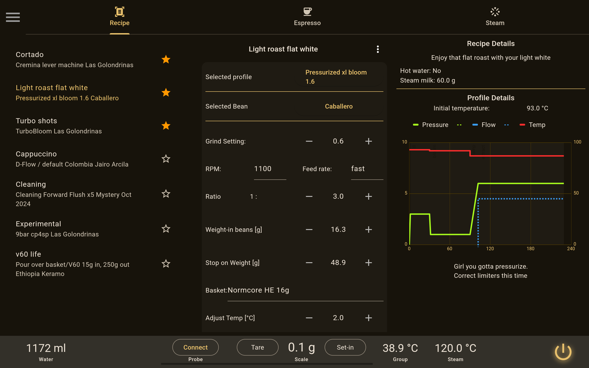
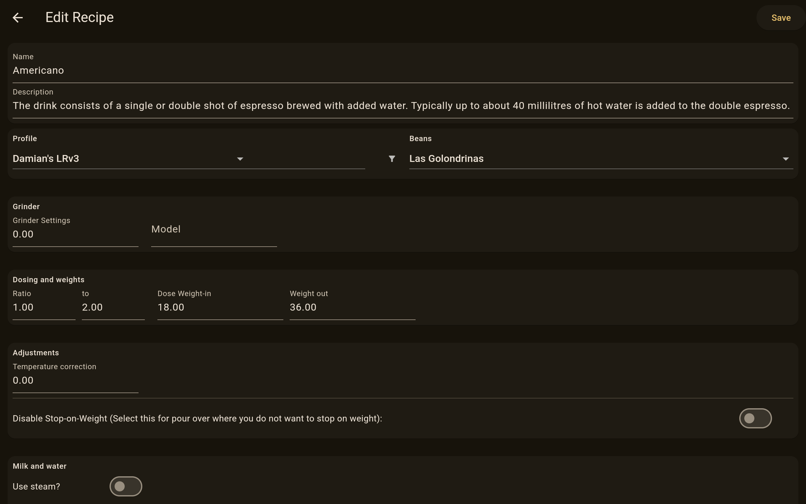
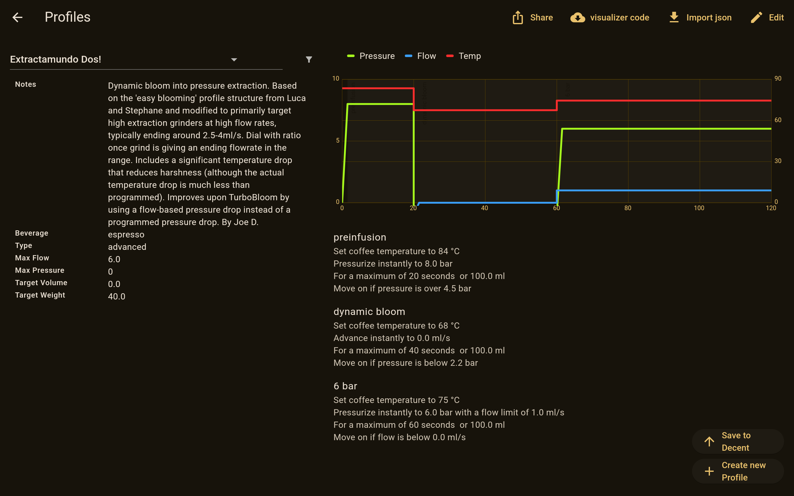
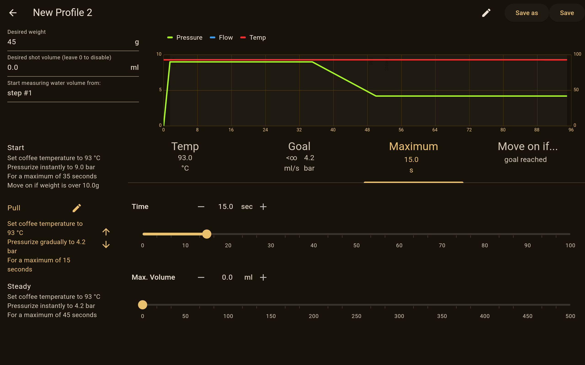
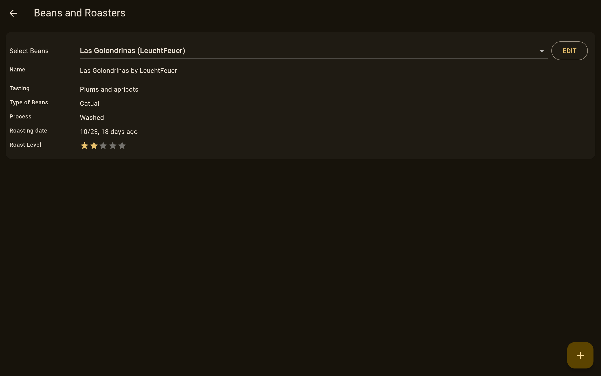
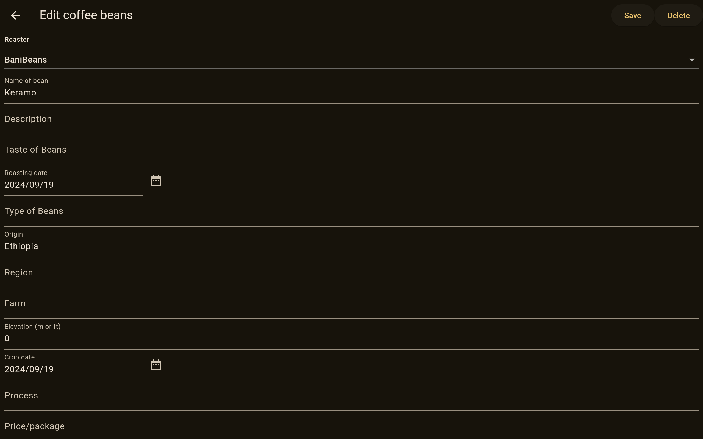
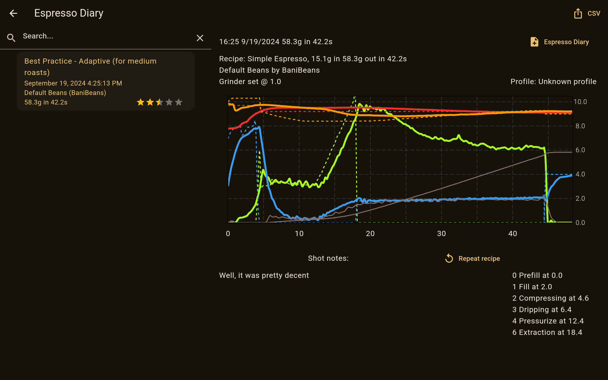
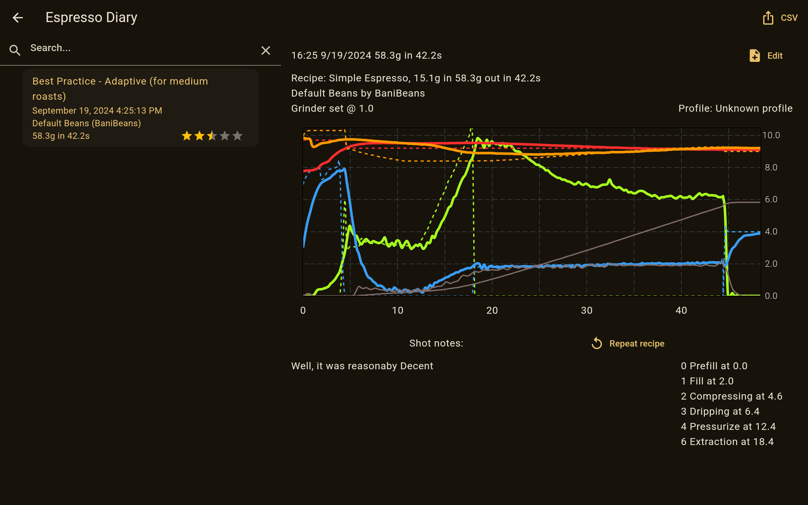

# REA

REA stands for Reasonable Espresso App. Its intended purpose is to cater to your coffee needs by talking to your Decent
Espresso DE1 (and hopefully soon Bengle) machine.

# Features

## Recipes screen

The recipes screen serves as your entry point into making shots with REA. It's the primary screen, from which you can
select the currently active recipe, change the current beans or profile, and edit the recipe parameters, such as ratio,
grind size and temperature adjustment.

### Editing recipes

You can edit the recipes by tapping the three dots button in the top right corner of the recipe details card (the middle
of the recipe screen).
From there, one can edit different things for the recipe, such as the recipe name and description, profile and beans,
grinder model and setting, ratio and many others.

You can also adjust whether the recipe reqires water or steam, which will subsequently enable the water and steam tabs
on the home page.

## Profiles screen

The profiles screen is your browser for the profiles stored in REA. It allows for seeing the profile details at a glance
as well as importing json profiles from disk or from [visualizer.coffee](http://visualizer.coffee).

### Creating or editing a profile

Additionally, you can edit profiles or create a new advanced profile in REA. The advanced profiles currently have the
most support as there is some work yet to be done for the pressure/flow/d-flow profiles. On the editor screen you can
rearrange, duplicate or remove profile steps, adjust the desired output volume or weight as well as change parameters
for each step individually.

## Bean cellar

To more easily manage the coffee beans that go with your tasty shots, you can use the beans screen. You can find some of
the more relevant information there directly, while you can see some more when going to the coffee edit screen. Each
coffee and subsequently roaster info can also be easily deleted, so that any mistakes won't pollute your choices.

### Adding new coffee beans

When adding new coffee beans, if they are from a new roaster, that data can easily be added on the coffee edit screen as
well.

## Shot diary

Welcome to the library! Here you can browse through your past shots, read the accompanying notes and also repeat a shot
you liked. What that means is that REA will pre-populate all your settings for the next shot with the settings from the
shot you want to replicate. Additionally you can also upload a shot you want to share with others directly to
[visualizer.coffee](https://visualizer.coffee).

### Editing a diary entry

When tapping edit on the selected shot in the diary screen, you are taken to it's details page. This is where you can
add or change information, such as notes, who made the drink and who drank it, as well as adjust data such as input dose, output weight or grind size setting.

## Support

Currently, REA is available and tested with Android only. You can get the apk from the releases page.

## Credits

REA is based on Despresso by @obiwan007 and owes a lot of its functionality to the authors of that amazing app.

Please check the credits page [here](https://github.com/obiwan007/despresso/blob/main/CREDITS.md).
